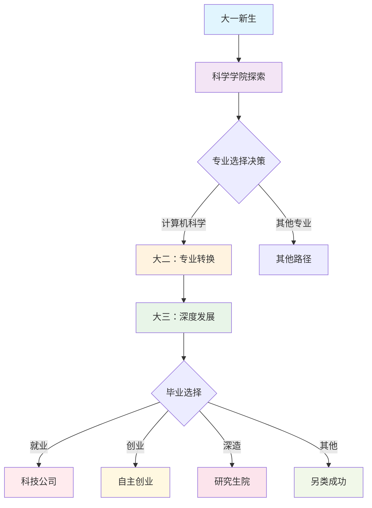
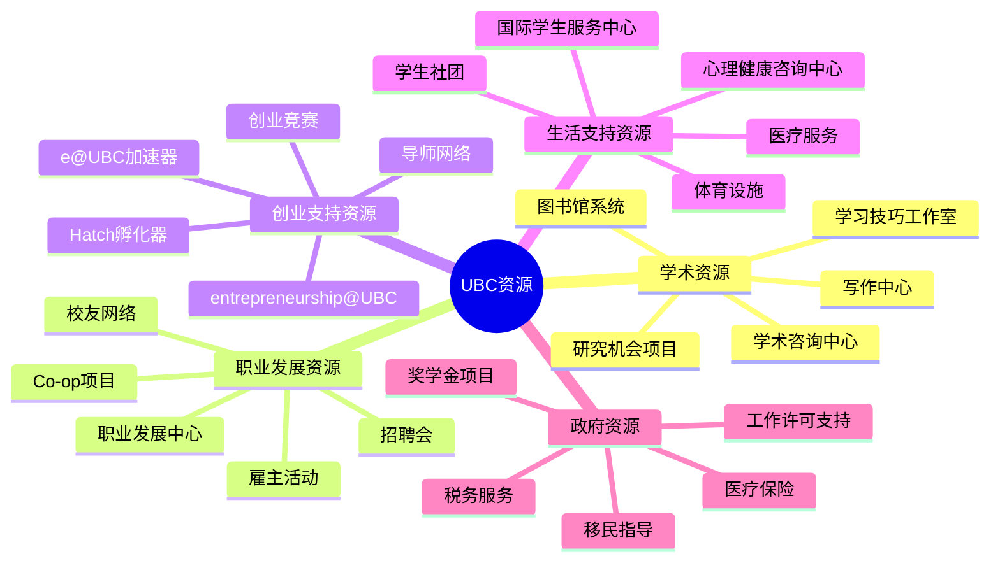
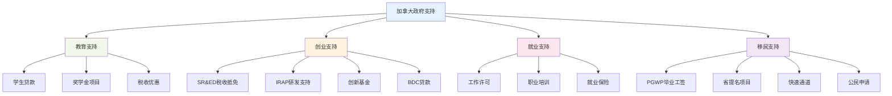
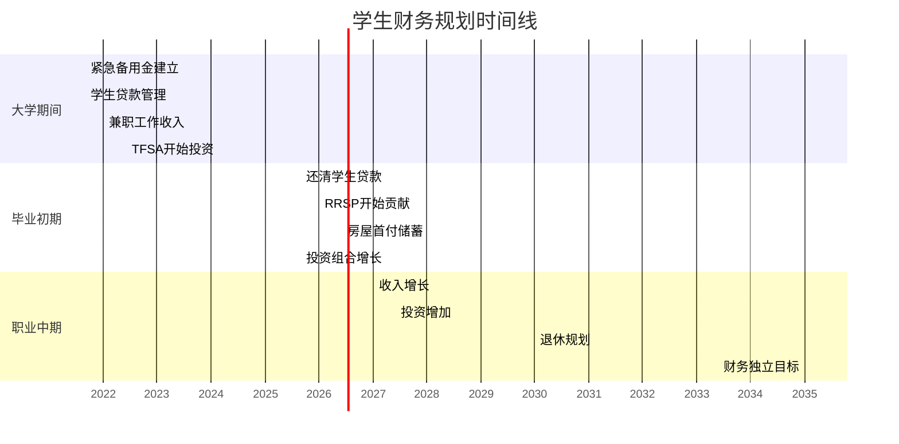
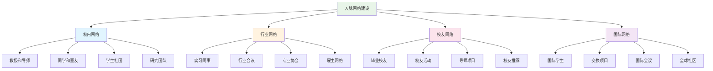
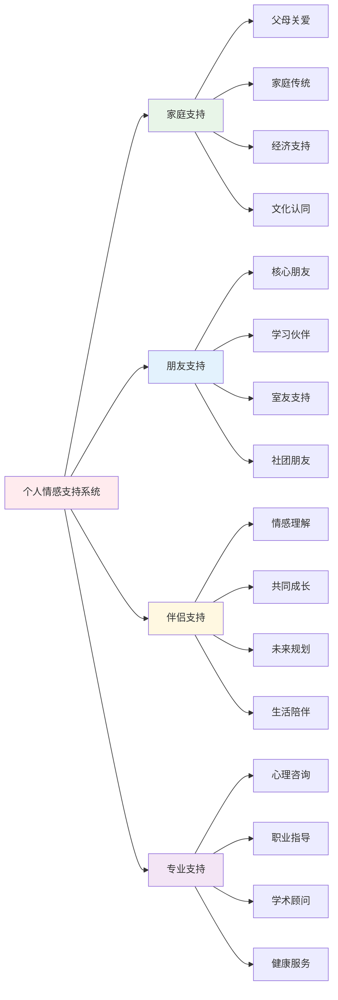
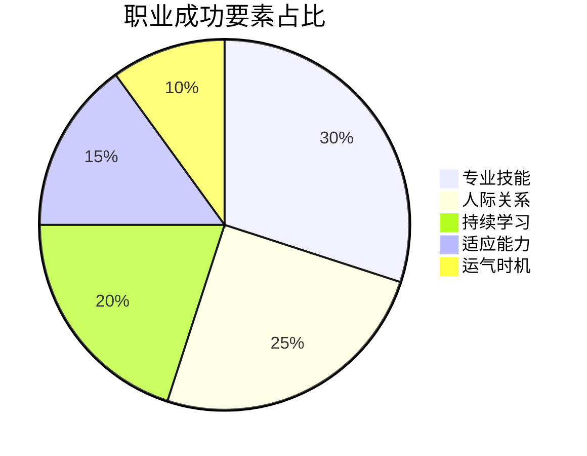
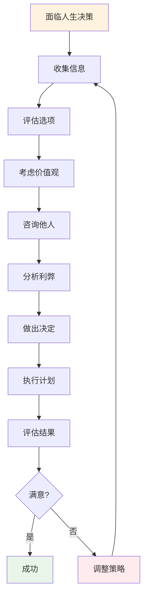

# 职业发展路径与资源图表

## UBC学生四年发展路径图

## 五个角色职业发展路径

```mermaid
graph LR
    subgraph "李明轩 - 创业者"
        A1[大一产生创业想法] --> A2[加入创业社团]
        A2 --> A3[Hatch孵化器]
        A3 --> A4[获得种子资金]
        A4 --> A5[公司快速发展]
        A5 --> A6[A轮融资成功]
    end
    
    subgraph "王小杰 - 技术专家"
        B1[大一转入计算机系] --> B2[Co-op实习]
        B2 --> B3[技术面试准备]
        B3 --> B4[获得顶级公司offer]
        B4 --> B5[职业发展]
        B5 --> B6[技术负责人]
    end
    
    subgraph "陈思雨 - 学术研究者"
        C1[优秀学术成绩] --> C2[研究助理]
        C2 --> C3[论文发表]
        C3 --> C4[博士申请]
        C4 --> C5[全额奖学金]
        C5 --> C6[学术生涯]
    end
    
    subgraph "刘晓梅 - 管理人才"
        D1[发现不适合编程] --> D2[职业重新评估]
        D2 --> D3[管理培训项目]
        D3 --> D4[超市轮岗学习]
        D4 --> D5[管理能力提升]
        D5 --> D6[部门主管]
    end
    
    subgraph "张浩然 - 商业领袖"
        E1[领导才能展现] --> E2[人脉建设]
        E2 --> E3[商业技能学习]
        E3 --> E4[管理培训生]
        E4 --> E5[MBA规划]
        E5 --> E6[高级管理者]
    end
```

## UBC资源利用体系

## 政府支持项目体系

## 财务规划时间线

## 技能与能力发展框架

## 人脉网络建设策略

## 情感支持系统

## 职业成功要素模型

## 人生决策框架

---

这些图表展示了UBC学生在大学期间和毕业后的全面发展路径，包括：

1. **职业发展路径图** - 展示从大一到毕业的各种选择和发展方向
2. **五个角色的具体路径** - 详细说明每个主人公的职业发展轨迹
3. **资源利用体系** - 系统展示UBC提供的各种资源
4. **政府支持项目** - 加拿大政府的各种支持政策
5. **财务规划时间线** - 不同阶段的财务目标
6. **技能发展雷达图** - 核心能力的发展重点
7. **人脉网络建设** - 如何建立和维护人际关系
8. **情感支持系统** - 重要的情感支持来源
9. **成功要素模型** - 职业成功的关键因素
10. **决策框架** - 做出重要人生决定的思考过程

这些图表为读者提供了清晰的视觉指导，帮助他们理解如何在UBC充分利用资源，实现个人和职业的成功发展。